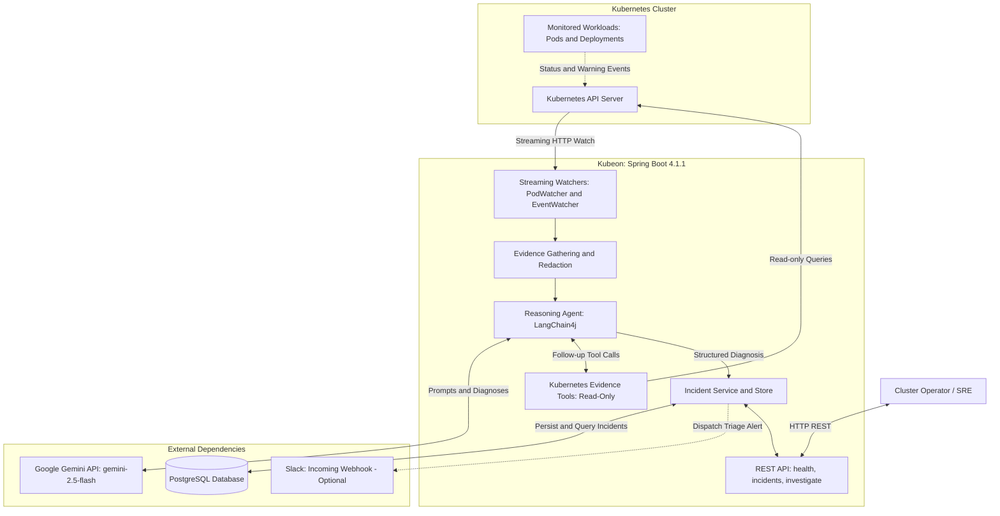
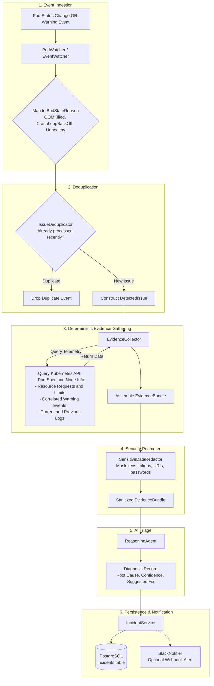
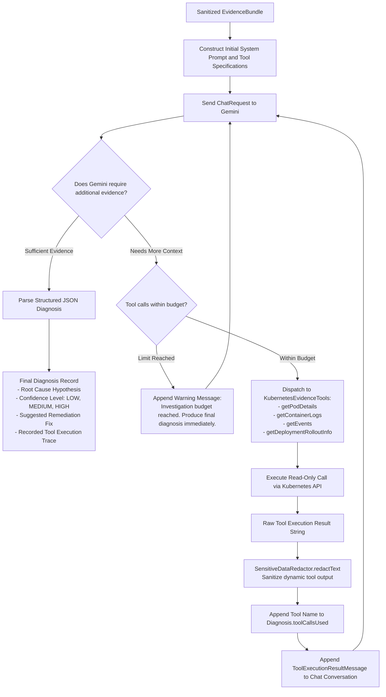
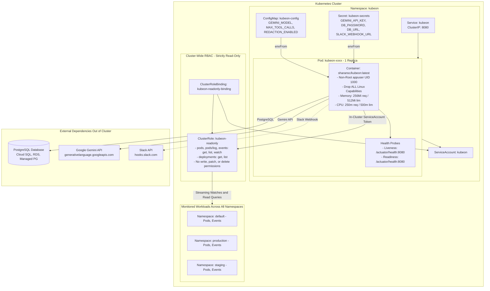
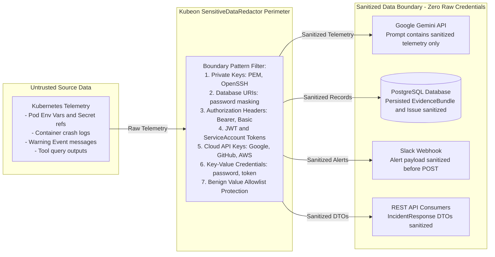

# Kubeon

Deterministic Kubernetes incident detection, automated evidence gathering, and AI-driven diagnosis with Google Gemini.

[](https://github.com/Sharan-0-dot/kubeon/actions/workflows/ci.yml)


[](https://hub.docker.com/r/sharansc/kubeon)
[](LICENSE)

---

## What is Kubeon?

**Kubeon** is an autonomous Kubernetes incident detection, investigation, and triage agent built on Java 21 and Spring Boot 4.1.1. It runs either as a self-monitoring in-cluster pod or as an external development process. 

Instead of waiting for human operators to notice broken workloads or review alerts across disconnected dashboards, Kubeon attaches streaming watchers directly to the Kubernetes API. When a pod enters a degraded state—such as `OOMKilled`, `CrashLoopBackOff`, or probe failure—Kubeon immediately collects correlated cluster evidence, strips credentials through a sensitive data redaction boundary, uses Google Gemini to determine root causes, and autonomously executes read-only diagnostic tools when initial evidence is insufficient. Diagnosed incidents are persisted to PostgreSQL and dispatched to Slack.

---

## Why Kubeon?

When a Kubernetes workload crashes in production, the initial triage procedure is manual, repetitive, and time-critical:

1. Identify which container in which pod failed.
2. Query `kubectl describe pod` to inspect termination reasons, exit codes, and recent events.
3. Fetch `kubectl logs --previous` before the crashing container's logs are rotated.
4. Compare container memory/CPU limits against actual resource spikes.
5. Inspect deployment rollout states and recent configuration changes.
6. Synthesize this data to produce a root-cause hypothesis and remediation plan.

Kubeon automates this entire diagnostic loop within seconds of failure occurrence. Crucially, Kubeon is architected with strict operational boundaries:

- **Zero Write Operations**: The agent has strictly read-only Kubernetes RBAC permissions (`get`, `list`, `watch`). It cannot modify, delete, or disrupt running cluster workloads.
- **Privacy Perimeter**: Raw logs, event messages, and pod specifications pass through an automated credential redactor before reaching external LLMs, persistence, or alert webhooks.
- **Deterministic First, AI Second**: Event detection and evidence collection are rule-based and deterministic. The LLM is invoked only to reason over concrete, assembled facts.
- **Controlled Agentic Loop**: If initial evidence is inconclusive, Gemini can execute follow-up Kubernetes inspection tools, strictly bounded by a maximum tool-call budget.

---

## Key Features

- **Real-Time Streaming Watchers**: Listens to Pod status transitions and Kubernetes Warning events via persistent streaming HTTP watches (`PodWatcher` and `EventWatcher`).
- **Failure Classification**: Automatically identifies and categorizes failures:
  - `OOM_KILLED` (Exit code 137 / Out of Memory)
  - `CRASH_LOOP_BACKOFF` (Repeated container crashes, non-zero exit codes)
  - `IMAGE_PULL_BACK_OFF` & `ERR_IMAGE_PULL` (Invalid image references, registry authentication failures)
  - `UNHEALTHY_PROBE` (Readiness and liveness probe timeouts and HTTP 5xx errors)
  - `FAILED_SCHEDULING` (Insufficient CPU/memory, node selector/affinity mismatches)
- **Sliding-Window Deduplication**: Thread-safe `IssueDeduplicator` suppresses duplicate alerts across overlapping event and status streams.
- **Automated Evidence Bundling**: Collects pod specs, container resource limits, correlated events, current logs, and previous terminated logs into an immutable `EvidenceBundle`.
- **Sensitive Data Redaction Perimeter**: Centralized `SensitiveDataRedactor` detects and masks private keys, database connection URIs, authorization headers, JWTs, cloud provider API keys, and credential key-value pairs (`[REDACTED]`).
- **Autonomous Gemini Reasoning**: Integrates Google Gemini via LangChain4j to analyze sanitized evidence and produce structured diagnoses with root causes, confidence levels (`LOW`, `MEDIUM`, `HIGH`), and remediation steps.
- **Agentic Tool-Calling Loop**: Reasoning agent dynamically invokes Kubernetes diagnostic tools (`getPodDetails`, `getContainerLogs`, `getEvents`, `getDeploymentRolloutInfo`) when additional context is required.
- **Persistent Incident Store**: Stores incidents, evidence snapshots, and diagnosis traces in PostgreSQL using Spring Data JPA.
- **Push & Pull Interfaces**: Real-time Slack notifications on auto-detected incidents, plus REST API for on-demand health scans, historical incident lookup, and manual pod investigation.
- **In-Cluster Security**: Designed for in-cluster deployment using ServiceAccount token authentication, non-root execution (UID 1000), dropped Linux capabilities, and read-only RBAC.

---

## Architecture

For an in-depth design specification and detailed architectural breakdown, see [**`docs/architecture.md`**](docs/architecture.md).



---

## Incident Detection Flow

Kubeon uses persistent streaming HTTP connections to observe pod status and cluster warning events. When an anomaly is detected, it is deduplicated and enriched with correlated cluster telemetry before entering the AI reasoning pipeline.



---

## Agentic Investigation Flow

If the initial `EvidenceBundle` contains insufficient context (e.g. empty logs, ambiguous restart codes, or multi-container interactions), Google Gemini dynamically requests follow-up inspections via read-only Kubernetes tools.



---

## Technology Stack

| Layer | Component | Version / Details |
|---|---|---|
| **Language** | Java | 21 (Eclipse Temurin LTS) |
| **Framework** | Spring Boot | 4.1.1 (WebMvc, Data JPA, Actuator, Validation) |
| **Kubernetes Client** | Fabric8 | 6.13.4 (Native HTTP client, streaming watches) |
| **LLM Orchestration** | LangChain4j | 1.20.2 (`langchain4j-google-ai-gemini`) |
| **Database** | PostgreSQL | 14+ (Driver: 42.7.13, Dialect: PostgreSQLDialect) |
| **ORM** | Hibernate | 7.4.5.Final |
| **JSON Processing** | Jackson | 2.21+ (JavaTime module, Databind) |
| **Containerization** | Docker | Multi-stage build on `eclipse-temurin:21-jre-alpine` |
| **Testing** | JUnit 5, Mockito, AssertJ | 69 automated unit & integration tests |

---

## Project Structure

```text
kubeon/
├── .github/
│   ├── workflows/
│   │   └── ci.yml                     # GitHub Actions CI (PostgreSQL 16, JDK 21 Temurin)
│   ├── ISSUE_TEMPLATE/
│   │   ├── bug_report.md              # Structured issue template for bug reports
│   │   └── feature_request.md         # Structured issue template for enhancements
│   └── pull_request_template.md       # PR checklist and review guidelines
├── Dockerfile                         # Multi-stage build (Temurin 21 build -> JRE 21 Alpine runtime)
├── .dockerignore                      # Build context exclusions (.env, git, target)
├── k8s/                               # Production Kubernetes deployment manifests
│   ├── namespace.yaml                 # Dedicated 'kubeon' namespace
│   ├── serviceaccount.yaml            # Pod identity for in-cluster API authentication
│   ├── clusterrole.yaml               # Strictly read-only RBAC (get, list, watch)
│   ├── clusterrolebinding.yaml        # Binds ClusterRole to ServiceAccount
│   ├── configmap.yaml                 # Non-sensitive configuration (model, limits)
│   ├── secret.yaml                    # Secret template for DB password and API keys
│   ├── deployment.yaml                # Single replica deployment with health probes
│   └── service.yaml                   # ClusterIP service exposing port 8080
├── demo-test-files/                   # Controlled failure manifests for testing
│   ├── oom-test.yaml                  # Memory limit exhaustion pod
│   └── deployment-crash-test.yaml     # Crashing container deployment
├── env.example                        # Template for environment configuration
├── pom.xml                            # Maven dependencies and build plugins
└── src/
    ├── main/
    │   ├── java/com/sharan/kubeon/
    │   │   ├── KubeonApplication.java          # Spring Boot main entry point
    │   │   ├── agent/tools/                    # Read-only LangChain4j @Tool methods
    │   │   ├── api/                            # REST controllers, DTOs, GlobalExceptionHandler
    │   │   ├── config/                         # Spring beans (GeminiConfig, KubernetesClientConfig)
    │   │   ├── detection/                      # Watcher deduplication and BadStateReason enums
    │   │   ├── incident/                       # Incident entity, JPA repository, IncidentService
    │   │   ├── kubernetes/                     # EvidenceCollector, PodWatcher, EventWatcher
    │   │   ├── notification/                   # SlackNotifier webhook client
    │   │   ├── reasoning/                      # ReasoningAgent, Diagnosis records, prompt templates
    │   │   └── security/                       # SensitiveDataRedactor regex perimeter
    │   └── resources/
    │       └── application.yaml                # Configuration properties with environment fallbacks
    └── test/                                   # Complete test suite (69 tests)
```

---

## Prerequisites

Before running Kubeon, ensure you have:

- **Java Development Kit (JDK)**: Version 21 or later.
- **Apache Maven**: Version 3.9+ (or use the provided `./mvnw` / `.\mvnw.cmd` wrapper).
- **PostgreSQL**: Version 14 or later (running locally or accessible via network).
- **Kubernetes Cluster**: A running cluster (Minikube, kind, k3s, EKS, GKE, AKS) with a valid `~/.kube/config`.
- **Google Gemini API Key**: An active API key from [Google AI Studio](https://aistudio.google.com/).
- **Slack Incoming Webhook** *(Optional)*: A webhook URL to receive real-time incident notifications.
- **Docker** *(Optional)*: Docker engine for building container images.

---

## Local Development

### 1. Clone the Repository

```bash
git clone https://github.com/Sharan-0-dot/kubeon.git
cd kubeon
```

### 2. Configure Environment Variables

Copy `env.example` to `.env`:

```bash
cp env.example .env
```

Edit `.env` with your actual credentials:

```bash
GEMINI_API_KEY=AIzaSy...your-actual-gemini-key
DB_PASSWORD=your-postgres-password
DB_URL=jdbc:postgresql://localhost:5432/kubeon
DB_USERNAME=postgres
GEMINI_MODEL=gemini-2.5-flash
MAX_TOOL_CALLS=3
REDACTION_ENABLED=true
CONNECTIVITY_CHECK_ENABLED=true
SLACK_WEBHOOK_URL=https://hooks.slack.com/services/...
```

> **Note**: `.env` is listed in `.gitignore` and `.dockerignore`. Never commit real credentials to Git.

### 3. Ensure PostgreSQL is Running

Create the `kubeon` database if it does not already exist:

```sql
CREATE DATABASE kubeon;
```

### 4. Ensure Your Kubernetes Cluster is Running

For Minikube:

```bash
minikube start
```

### 5. Run the Application

```bash
# On Linux / macOS:
./mvnw spring-boot:run

# On Windows PowerShell:
.\mvnw.cmd spring-boot:run
```

When started locally, `KubeonApplication` automatically reads `.env`, connects to Minikube via `~/.kube/config`, performs a cluster connectivity check, starts streaming watchers, connects to PostgreSQL, and exposes the HTTP server on port `8080`.

---

## Environment Variables

| Variable | Description | Default | Required in Production |
|---|---|---|---|
| `GEMINI_API_KEY` | Google Gemini API Key | *(empty)* | **Yes** |
| `GEMINI_MODEL` | Gemini model name | `gemini-2.0-flash` | No |
| `DB_URL` | PostgreSQL JDBC connection URL | `jdbc:postgresql://localhost:5432/kubeon` | **Yes** |
| `DB_USERNAME` | PostgreSQL database user | `postgres` | No |
| `DB_PASSWORD` | PostgreSQL database password | *(empty)* | **Yes** |
| `SLACK_WEBHOOK_URL` | Slack incoming webhook URL | *(empty)* | No |
| `MAX_TOOL_CALLS` | Max tool executions per investigation | `3` | No |
| `REDACTION_ENABLED` | Enable sensitive data masking | `true` | No |
| `CONNECTIVITY_CHECK_ENABLED` | Verify pod listing on startup | `true` | No |

---

## Running with Docker

The official container image is published on Docker Hub as **[`sharansc/kubeon:latest`](https://hub.docker.com/r/sharansc/kubeon)**.

### Pull the Image

```bash
docker pull sharansc/kubeon:latest
```

### Build Locally

```bash
docker build -t sharansc/kubeon:latest .
```

### Run Container Locally

When testing the container outside Kubernetes, connect it to your host PostgreSQL instance and pass credentials via environment variables:

```bash
# On Linux (using host network):
docker run --rm \
  -e DB_URL=jdbc:postgresql://localhost:5432/kubeon \
  -e DB_USERNAME=postgres \
  -e DB_PASSWORD=your_password \
  -e GEMINI_API_KEY=your_key \
  -e CONNECTIVITY_CHECK_ENABLED=false \
  -p 8080:8080 \
  sharansc/kubeon:latest

# On Windows / macOS (using host.docker.internal):
docker run --rm `
  -e DB_URL=jdbc:postgresql://host.docker.internal:5432/kubeon `
  -e DB_USERNAME=postgres `
  -e DB_PASSWORD=your_password `
  -e GEMINI_API_KEY=your_key `
  -e CONNECTIVITY_CHECK_ENABLED=false `
  -p 8080:8080 `
  sharansc/kubeon:latest
```

### Container Security Features

- **Non-Root Execution**: Runs as user `appuser` (UID `1000`, GID `1000`).
- **No Secret Baking**: The build stage excludes `.env` and sensitive files via `.dockerignore`.
- **Built-in Healthcheck**: Includes a Docker `HEALTHCHECK` probe querying `/actuator/health` every 30 seconds.

---

## Running on Kubernetes

Kubeon includes production-ready manifests in the [`k8s/`](k8s/) directory.



### Manifest Overview

| File | Resource | Purpose |
|---|---|---|
| [`k8s/namespace.yaml`](k8s/namespace.yaml) | `Namespace` | Creates isolated `kubeon` namespace |
| [`k8s/serviceaccount.yaml`](k8s/serviceaccount.yaml) | `ServiceAccount` | Identity used by Kubeon to authenticate against the K8s API |
| [`k8s/clusterrole.yaml`](k8s/clusterrole.yaml) | `ClusterRole` | Strictly read-only access (`get`, `list`, `watch`) |
| [`k8s/clusterrolebinding.yaml`](k8s/clusterrolebinding.yaml) | `ClusterRoleBinding` | Grants the ClusterRole to the `kubeon` ServiceAccount |
| [`k8s/configmap.yaml`](k8s/configmap.yaml) | `ConfigMap` | Non-sensitive settings (`GEMINI_MODEL`, `MAX_TOOL_CALLS`) |
| [`k8s/secret.yaml`](k8s/secret.yaml) | `Secret` | Template for sensitive keys (`GEMINI_API_KEY`, `DB_PASSWORD`) |
| [`k8s/deployment.yaml`](k8s/deployment.yaml) | `Deployment` | Single replica deployment with resource limits and probes |
| [`k8s/service.yaml`](k8s/service.yaml) | `Service` | ClusterIP service exposing port 8080 internally |

### Deployment Steps

#### 1. Create the Namespace

```bash
kubectl apply -f k8s/namespace.yaml
```

#### 2. Create the Secret

> **WARNING**: Never commit real passwords or API keys to Git. Create the secret imperatively:

```bash
kubectl create secret generic kubeon-secrets \
  --namespace kubeon \
  --from-literal=GEMINI_API_KEY="your-gemini-api-key" \
  --from-literal=DB_URL="jdbc:postgresql://your-postgres-host:5432/kubeon" \
  --from-literal=DB_USERNAME="postgres" \
  --from-literal=DB_PASSWORD="your-postgres-password" \
  --from-literal=SLACK_WEBHOOK_URL="https://hooks.slack.com/services/..."
```

#### 3. Apply Remaining Manifests

```bash
kubectl apply -f k8s/serviceaccount.yaml
kubectl apply -f k8s/clusterrole.yaml
kubectl apply -f k8s/clusterrolebinding.yaml
kubectl apply -f k8s/configmap.yaml
kubectl apply -f k8s/deployment.yaml
kubectl apply -f k8s/service.yaml
```

#### 4. Verify Pod Status

```bash
kubectl get pods -n kubeon
kubectl logs -n kubeon deployment/kubeon -f
```

---

## PostgreSQL Configuration

Kubeon requires PostgreSQL for persistent incident storage. 

- **Database**: PostgreSQL 14 or newer.
- **Connection**: Configured via standard JDBC URL (`jdbc:postgresql://<host>:<port>/<dbname>`).
- **Schema Management**: Spring Data JPA automatically manages table schemas (`ddl-auto: update`).
- **Entity**: Incidents are stored in the `incidents` table with structured columns for timestamps, namespaces, pod names, trigger types, status, root cause, confidence, suggested fixes, tool call traces, and evidence bundles serialized as text.
- **Production Architecture**: In production, connect Kubeon to an externally managed PostgreSQL instance (e.g. AWS RDS, GCP Cloud SQL, Azure Database for PostgreSQL, or a dedicated database operator). PostgreSQL does not run inside the Kubeon container.

---

## REST API

All endpoints are hosted under `/api`.

### 1. Cluster Health Overview

Returns high-level health metrics across all pods in all namespaces.

```bash
GET /api/health
```

**Example Request:**
```bash
curl -s http://localhost:8080/api/health
```

**Example Response:**
```json
{
  "totalPods": 14,
  "healthyPods": 12,
  "unhealthyPods": 2,
  "detectedIssues": [
    {
      "namespace": "default",
      "podName": "oom-test",
      "reason": "OOM_KILLED",
      "detectedAt": "2026-10-03T10:15:30.123Z",
      "sourceMessage": "Container exceeded 50Mi memory limit"
    }
  ]
}
```

---

### 2. List Incidents

Retrieves all recorded incidents. Supports optional namespace filtering.

```bash
GET /api/incidents
GET /api/incidents?namespace=default
```

**Example Request:**
```bash
curl -s http://localhost:8080/api/incidents?namespace=default
```

**Example Response:**
```json
[
  {
    "id": "e4b3c9a1-8d2e-4f5a-9c3b-7a1d5e8f9b2c",
    "namespace": "default",
    "podName": "oom-test",
    "triggerType": "AUTO_DETECTED",
    "status": "DIAGNOSED",
    "detectedReason": "OOM_KILLED",
    "createdAt": "2026-10-03T10:15:30.123Z",
    "updatedAt": "2026-10-03T10:15:34.567Z",
    "diagnosis": {
      "rootCauseHypothesis": "Container 'stress' terminated with exit code 137 due to OOMKilled. Process exceeded the configured limit of 50Mi.",
      "confidence": "HIGH",
      "suggestedFix": "Increase container memory limit in the pod specification to at least 256Mi.",
      "toolCallsUsed": ["getPodDetails"],
      "modelUsed": "gemini-2.5-flash"
    }
  }
]
```

---

### 3. Get Incident by ID

Fetches the complete details of a specific incident by its UUID.

```bash
GET /api/incidents/{id}
```

**Example Request:**
```bash
curl -s http://localhost:8080/api/incidents/e4b3c9a1-8d2e-4f5a-9c3b-7a1d5e8f9b2c
```

---

### 4. Manual On-Demand Investigation

Triggers a manual investigation for any target pod in any namespace. Gathers evidence, runs Gemini diagnosis, stores the incident, and returns the result.

```bash
POST /api/investigate/{namespace}/{pod}
```

**Example Request:**
```bash
curl -s -X POST http://localhost:8080/api/investigate/default/my-failing-pod
```

---

### 5. Actuator Health Probes

```bash
GET /actuator/health
```

**Example Response:**
```json
{
  "status": "UP"
}
```

---

## Testing

### Automated Test Suite

Kubeon contains **69 unit and integration tests** verifying all layers without requiring active internet connectivity or live external secrets:

- `SensitiveDataRedactorTest`: Pattern matching, boundary sanitization, diagnostic token preservation.
- `ReasoningAgentTest`: Gemini prompt framing, JSON extraction, agentic tool dispatching, limit enforcement.
- `KubernetesEvidenceToolsTest`: Read-only tool execution, input boundary validation, tail line caps.
- `EvidenceCollectorTest`: Multi-container telemetry aggregation, previous log retrieval, API failure resilience.
- `IssueDeduplicatorTest`: Thread safety, sliding window alert suppression.
- `PostgresIncidentRepositoryTest`: JPA entity mapping and JSON serialization.
- `IncidentControllerTest` & `HealthControllerTest`: WebMvc mock testing of API endpoints.
- `ClusterConnectivityCheckTest`: Conditional property activation and headless environments.

Run the test suite using Maven:

```bash
# Linux / macOS:
./mvnw test

# Windows PowerShell:
.\mvnw.cmd test
```

### Live Failure Scenario Testing

To test Kubeon against a real cluster (such as Minikube), deploy the controlled test manifests in [`demo-test-files/`](demo-test-files/):

```bash
# 1. Trigger OOMKilled failure
kubectl apply -f demo-test-files/oom-test.yaml

# 2. Trigger CrashLoopBackOff failure
kubectl apply -f demo-test-files/deployment-crash-test.yaml

# 3. Trigger ImagePullBackOff
kubectl run pull-failure-test --image=nonexistent-repo/missing-image:latest

# 4. View Kubeon's real-time diagnostic output
# (In your local terminal or container logs)

# 5. Clean up test workloads
kubectl delete -f demo-test-files/oom-test.yaml
kubectl delete -f demo-test-files/deployment-crash-test.yaml
kubectl delete pod pull-failure-test
```

---

## Configuration Reference

| Property Key | Environment Variable | Default | Description |
|---|---|---|---|
| `spring.datasource.url` | `DB_URL` | `jdbc:postgresql://localhost:5432/kubeon` | PostgreSQL JDBC connection URL |
| `spring.datasource.username` | `DB_USERNAME` | `postgres` | PostgreSQL connection username |
| `spring.datasource.password` | `DB_PASSWORD` | *(empty)* | PostgreSQL connection password |
| `kubeon.gemini.api-key` | `GEMINI_API_KEY` | *(empty)* | Google Gemini API key |
| `kubeon.gemini.model` | `GEMINI_MODEL` | `gemini-2.0-flash` | Gemini model identifier |
| `kubeon.gemini.temperature` | — | `0.1` | Sampling temperature for diagnostic consistency |
| `kubeon.gemini.timeout-seconds` | — | `30` | Network timeout for LLM reasoning calls |
| `kubeon.reasoning.max-tool-calls`| `MAX_TOOL_CALLS` | `3` | Maximum follow-up tool calls per investigation |
| `kubeon.slack.webhook-url` | `SLACK_WEBHOOK_URL` | *(empty)* | Slack incoming webhook endpoint URL |
| `kubeon.slack.notify-on-manual` | — | `false` | Send Slack alerts on manual `/api/investigate` |
| `kubeon.redaction.enabled` | `REDACTION_ENABLED` | `true` | Toggle credential masking perimeter |
| `kubeon.connectivity-check.enabled` | `CONNECTIVITY_CHECK_ENABLED` | `true` | Run pod listing check on startup |
| `kubeon.watcher.enabled` | — | `true` | Enable background streaming watchers |

---

## Security Model & RBAC

Kubeon establishes an explicit security perimeter between raw cluster telemetry and external systems (Gemini, PostgreSQL, Slack, and REST API). Raw credentials, tokens, and secrets are intercepted and redacted before any data leaves the local boundary.



### Least-Privilege Kubernetes RBAC

Kubeon's [`ClusterRole`](k8s/clusterrole.yaml) is strictly read-only:

```yaml
rules:
  - apiGroups: [""]
    resources: ["pods", "pods/log", "events"]
    verbs: ["get", "list", "watch"]
  - apiGroups: ["apps"]
    resources: ["deployments"]
    verbs: ["get", "list"]
```

- **No Mutating Verbs**: Kubeon does **not** request `create`, `update`, `patch`, or `delete` verbs.
- **No Secret Access**: Kubeon does **not** request read access to Kubernetes `Secret` resources.
- **No Host Kubeconfig Mounting**: Uses native in-cluster authentication via `/var/run/secrets/kubernetes.io/serviceaccount`.
- **Non-Root Container**: Pod runs with `runAsNonRoot: true`, UID `1000`, `allowPrivilegeEscalation: false`, and drops all Linux capabilities.

---

## Troubleshooting

### 1. Database Connection Refused (`localhost:5432`)
- **Cause**: Kubeon cannot reach PostgreSQL.
- **Solution**: When running in Docker, `localhost` refers to the container itself. Use `-e DB_URL=jdbc:postgresql://host.docker.internal:5432/kubeon` on Docker Desktop, or configure your managed database host.

### 2. Gemini ChatModel Not Configured
- **Cause**: `GEMINI_API_KEY` is empty or unset.
- **Solution**: Export `GEMINI_API_KEY` in your `.env` or pass it via Docker/K8s Secret. Kubeon will start without Gemini, but AI reasoning calls will report that the model is unconfigured.

### 3. Kubernetes Watch Fails in CI / Standalone Test
- **Cause**: No cluster or kubeconfig exists in headless testing environments.
- **Solution**: Set `CONNECTIVITY_CHECK_ENABLED=false` and `kubeon.watcher.enabled=false`.

### 4. Slack Notifications Not Arriving
- **Cause**: `SLACK_WEBHOOK_URL` is empty, invalid, or blocked by an egress firewall.
- **Solution**: Verify the webhook URL in `.env` or `k8s/secret.yaml`. Check Kubeon application logs for Slack HTTP response codes.

---

## Limitations / Known Boundaries

- **Read-Only Scope**: Kubeon diagnoses incidents and suggests fixes; it does not automatically execute remediation actions (such as restarting pods or rolling back deployments).
- **Single-Replica Deployment**: In v1, Kubeon is designed to run as a single replica. Running multiple concurrent replicas without leader election may result in duplicate event handling.
- **Pattern-Based Redaction**: While `SensitiveDataRedactor` covers standard keys, tokens, URIs, and credentials, arbitrary unstructured secrets without identifying metadata or known token prefixes may not be recognized.
- **LLM Rate Limits**: Large-scale failure storms across thousands of pods simultaneously may encounter Gemini API quota limits.

---

## Roadmap / Future Work

- **Metrics-Based Anomaly Detection (v2)**: Proactive memory leak and CPU throttling detection using Prometheus metrics before failure states occur.
- **Leader Election for High Availability**: Active-passive replica coordination using Kubernetes Lease API for multi-replica deployments.
- **Approval-Gated Remediation**: Operator-confirmed remediation actions (e.g. restart pod, rollback deployment) using a separate, write-enabled RBAC role.
- **Official Helm Chart**: Packaged Helm chart with customizable `values.yaml` for enterprise Kubernetes deployments.

---

## Contributing

We welcome contributions from the community! Please read our [Contributing Guide](CONTRIBUTING.md) for code standards, testing requirements, and the pull request process.

---

## Security

Security is critical for cluster tooling. If you discover a vulnerability or potential security flaw, please review our [Security Policy](SECURITY.md) and report it responsibly via email. **Do not create public GitHub issues for security vulnerabilities.**

---

## License

This project is licensed under the **MIT License**. See the [LICENSE](LICENSE) file for details.
