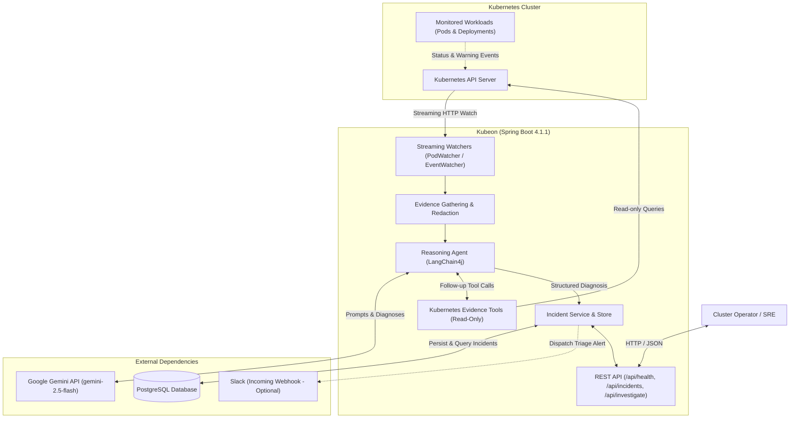
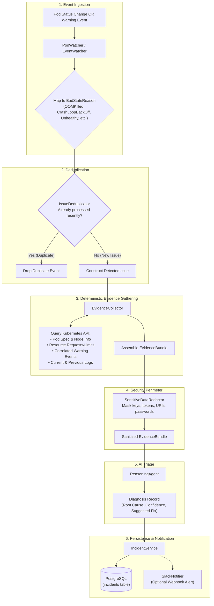
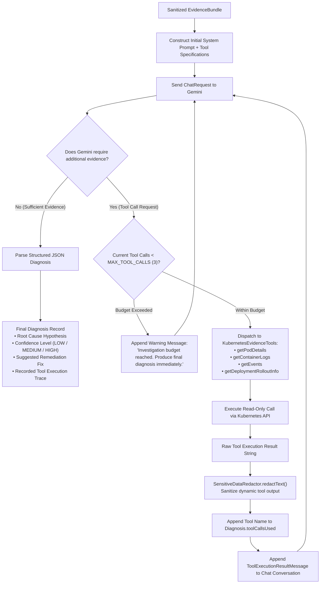

# Kubeon — Architecture & Design Specification

This document provides a detailed technical description of the architecture, data flows, agentic reasoning loop, deployment topology, and security perimeter of **Kubeon**.

---

## Table of Contents

1. [High-Level Architecture](#1-high-level-architecture)
2. [Incident Detection & Triage Flow](#2-incident-detection--triage-flow)
3. [Agentic Investigation Loop](#3-agentic-investigation-loop)
4. [Kubernetes Deployment Topology](#4-kubernetes-deployment-topology)
5. [Security Boundary & Data Redaction](#5-security-boundary--data-redaction)

---

## 1. High-Level Architecture

Kubeon is structured as a modular Spring Boot 4.1.1 service that acts as an autonomous triage agent for Kubernetes clusters. It attaches to the Kubernetes API server using Fabric8 streaming HTTP watches, listens for pod degradation events, gathers deterministic diagnostic telemetry, redacts credentials, queries Google Gemini via LangChain4j for root-cause analysis, and records structured incidents in PostgreSQL.



### Component Roles

- **Kubernetes API Server**: The control plane endpoint for streaming watches (`/api/v1/pods?watch=true`, `/api/v1/events?watch=true`) and read-only telemetry queries.
- **PodWatcher & EventWatcher**: Background daemon components holding long-lived HTTP streaming watches to catch real-time state changes without polling.
- **IssueDeduplicator**: Thread-safe in-memory cache suppressing duplicate alarms across concurrent event streams within a configurable time window.
- **EvidenceCollector**: Deterministic service aggregating pod specifications, resource limits, previous/current container logs, and correlated Warning events into an `EvidenceBundle`.
- **SensitiveDataRedactor**: Security component scrubbing secrets, tokens, private keys, and passwords before data crosses any external boundary.
- **ReasoningAgent**: LangChain4j-powered reasoning service constructing structured prompts and executing native LLM function/tool calls with Google Gemini.
- **KubernetesEvidenceTools**: Spring component exposing read-only `@Tool` methods to allow Gemini to pull follow-up evidence on demand.
- **IncidentService & PostgresIncidentRepository**: Incident lifecycle manager persisting immutable incident records and diagnostic snapshots into PostgreSQL.
- **SlackNotifier**: Outbound webhook client formatting rich markdown Slack notifications with failure isolation.
- **REST API**: WebMvc controller layer providing operational endpoints (`/api/health`, `/api/incidents`, `/api/investigate`).

---

## 2. Incident Detection & Triage Flow

The triage flow is divided into six deterministic phases. Rule-based detection and telemetry collection happen prior to any LLM invocation.



### Detection Details

1. **Ingestion**:
   - `PodWatcher` inspects `ContainerStatus` objects within `status.containerStatuses` and `status.initContainerStatuses` for `waiting` or `terminated` states matching failure reasons.
   - `EventWatcher` catches Warning events with reasons such as `Unhealthy`, `FailedScheduling`, `FailedCreatePodSandBox`, and `BackOff`.
2. **Deduplication**:
   - Uses a composite key (`namespace:podName:reason`). If an issue with the same signature was processed within the deduplication window (default: 5 minutes), the event is dropped to avoid alert storms.
3. **Evidence Collection**:
   - Fetches pod specifications (node assignment, labels, QoS class, container definitions).
   - Fetches container resource requests and limits (`resources.limits.memory`, `resources.requests.cpu`).
   - Fetches the last 50 lines of container logs, falling back to `--previous` if the container is currently terminated or restarting.
   - Lists recent Kubernetes Warning events involving the target pod.
4. **Redaction**:
   - The assembled `EvidenceBundle` passes through `SensitiveDataRedactor`, returning an immutable, sanitized instance.
5. **AI Reasoning**:
   - `ReasoningAgent` submits the sanitized evidence to Gemini using a strict prompt enforcing JSON output and grounding rules.
6. **Egress**:
   - An `Incident` entity is updated with status `DIAGNOSED`, stored in PostgreSQL, and optionally sent to Slack.

---

## 3. Agentic Investigation Loop

When initial evidence is incomplete or ambiguous, Gemini can autonomously request additional cluster information using LangChain4j's native tool-calling protocol.



### Agentic Loop Safeguards

- **Budget Enforcement (`MAX_TOOL_CALLS`)**: Configurable limit (default: 3) preventing infinite tool-calling loops or runaway LLM API costs.
- **Strict Read-Only Dispatch**: Tools only support `get` and `list` operations. They cannot create, edit, patch, or delete any resource.
- **Input Validation**: Namespaces, pod names, and container names are validated for length, whitespace, and legal characters before being passed to the Kubernetes API.
- **Dynamic Redaction**: Tool execution outputs pass through `SensitiveDataRedactor.redactText()` before being appended to the LLM conversation history.
- **Fallback Parsing**: If Gemini returns unstructured text instead of valid JSON, a fallback parser extracts the hypothesis, assigns `ConfidenceLevel.LOW`, and recommends manual review.

---

## 4. Kubernetes Deployment Topology

In a production Kubernetes cluster, Kubeon is deployed inside a dedicated namespace with minimal RBAC permissions and clear isolation from external data stores.

```mermaid
flowchart TD
    subgraph CLUSTER["Kubernetes Cluster"]
        subgraph NS["Namespace: kubeon"]
            SA["ServiceAccount: kubeon"]
            CM["ConfigMap: kubeon-config<br/>(GEMINI_MODEL, MAX_TOOL_CALLS, REDACTION_ENABLED)"]
            SEC["Secret: kubeon-secrets<br/>(GEMINI_API_KEY, DB_PASSWORD, DB_URL, SLACK_WEBHOOK_URL)"]
            
            subgraph POD["Pod: kubeon-xxxx (1 Replica)"]
                CONT["Container: sharansc/kubeon:latest<br/>• Non-Root (appuser UID: 1000)<br/>• Drop ALL Linux Capabilities<br/>• Memory: 256Mi req / 512Mi lim<br/>• CPU: 250m req / 500m lim"]
                PROBES["Health Probes<br/>• Liveness: /actuator/health (port 8080)<br/>• Readiness: /actuator/health (port 8080)"]
            end
            
            SVC["Service: kubeon<br/>(ClusterIP: 8080)"]
        end

        subgraph RBAC["Cluster-Wide RBAC (Strictly Read-Only)"]
            CR["ClusterRole: kubeon-readonly<br/>• pods, pods/log, events: get, list, watch<br/>• deployments: get, list<br/>• (No write/patch/delete permissions)"]
            CRB["ClusterRoleBinding: kubeon-readonly-binding"]
        end

        subgraph MONITORED["Monitored Workloads Across All Namespaces"]
            W1["Namespace: default (Pods, Events)"]
            W2["Namespace: production (Pods, Events)"]
            W3["Namespace: staging (Pods, Events)"]
        end
    end

    subgraph EXT["External Dependencies (Out of Cluster)"]
        EXT_PG[("PostgreSQL Database<br/>(Cloud SQL / RDS / Managed PG)")]
        EXT_GEMINI["Google Gemini API<br/>(https://generativelanguage.googleapis.com)"]
        EXT_SLACK["Slack API<br/>(https://hooks.slack.com)"]
    end

    CRB --> CR
    CRB --> SA
    POD --> SA
    CM -->|envFrom| CONT
    SEC -->|envFrom| CONT
    SVC --> POD
    CONT --> PROBES
    CONT -->|In-Cluster ServiceAccount Token| CR
    CR -->|Streaming Watches & Read Queries| MONITORED
    CONT -->|JDBC (TCP 5432)| EXT_PG
    CONT -->|HTTPS (TCP 443)| EXT_GEMINI
    CONT -.->|HTTPS (TCP 443)| EXT_SLACK
```

### Infrastructure Principles

- **In-Cluster Authentication**: Kubeon auto-detects `/var/run/secrets/kubernetes.io/serviceaccount/token`. Host `~/.kube/config` files are never mounted in production containers.
- **Resource Constraints**: Requests `256Mi` RAM / `250m` CPU, bounded by `512Mi` RAM / `500m` CPU limits.
- **Probes**: Uses Spring Boot Actuator's `/actuator/health` endpoint for Kubernetes liveness and readiness checks.
- **Database Separation**: PostgreSQL runs externally (or as an independent managed service); it is not bundled inside the Kubeon application container.

---

## 5. Security Boundary & Data Redaction

Kubeon establishes an explicit security boundary between raw cluster telemetry and external systems (Gemini, PostgreSQL, Slack, REST API).

```mermaid
flowchart LR
    subgraph UNTRUSTED["Untrusted Source Data"]
        K8S_RAW["Kubernetes Telemetry<br/>• Pod Env Vars & Secret refs<br/>• Container crash logs<br/>• Warning Event messages<br/>• Tool query outputs"]
    end

    subgraph PERIMETER["Kubeon SensitiveDataRedactor Perimeter"]
        PATTERNS["Boundary Pattern Filter:<br/>1. Private Keys (PEM / OpenSSH)<br/>2. Database URIs (password masking)<br/>3. Authorization Headers (Bearer/Basic)<br/>4. JWT & ServiceAccount Tokens<br/>5. Cloud API Keys (AIza..., ghp_..., AKIA...)<br/>6. Key-Value Credentials (password=..., etc.)<br/>7. Benign Value Allowlist Protection"]
    end

    subgraph TRUSTED["Sanitized Data Boundary (Zero Raw Credentials)"]
        DEST_LLM["Google Gemini API<br/>(Prompt contains sanitized telemetry only)"]
        DEST_DB[("PostgreSQL Database<br/>(Persisted EvidenceBundle & Issue sanitized)")]
        DEST_SLACK["Slack Webhook<br/>(Alert payload sanitized before POST)"]
        DEST_API["REST API Consumers<br/>(IncidentResponse DTOs sanitized)"]
    end

    K8S_RAW -->|Raw Text| PATTERNS
    PATTERNS -->|Replaced with [REDACTED]| DEST_LLM
    PATTERNS -->|Replaced with [REDACTED]| DEST_DB
    PATTERNS -->|Replaced with [REDACTED]| DEST_SLACK
    PATTERNS -->|Replaced with [REDACTED]| DEST_API
```

### Data Safety Guarantees

1. **LLM Boundary Protection**: Raw logs, event messages, and dynamic tool outputs are sanitized before being serialized into the Gemini system prompt or tool execution result messages.
2. **Persistence Boundary Protection**: `IncidentService` redacts detected issue messages and evidence bundles before writing to PostgreSQL.
3. **Notification Boundary Protection**: Formatted Slack markdown alerts pass through `redactText()` before HTTP payload transmission.
4. **False-Positive Resistance**: Benign tokens (`true`, `false`, `null`, `none`, `<none>`, `disabled`, `[redacted]`) and critical diagnostic tokens (reasons, exit codes, container names, memory limits) are preserved to maintain full diagnostic usefulness.
